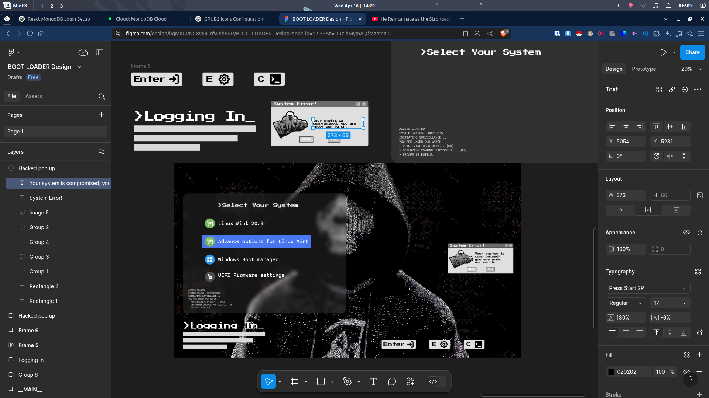

# Hacker GRUB Theme  

A sleek and customizable GRUB theme for Linux systems.  

  

## Installation Instructions  
those __MAIN__ image files are not necessary you can delete them if you want or rename them to background.png or replace background.png with your own wallpaper. 
### 1. Copy the theme folder  
Replace `/home/pavan/Downloads/` with the path where the theme folder is located:  
```bash  
sudo cp -r /home/pavan/Downloads/Hacker_grub/ /boot/grub/themes/  
```  

### 2. Apply the theme  
Edit the GRUB configuration file to add your new theme:  
```bash  
sudo nano /etc/default/grub  
```  
Add or update this line:  
```text  
GRUB_THEME="/boot/grub/themes/Hacker_grub/theme.txt"  
```  

### 3. Reload GRUB  
Regenerate the GRUB configuration to apply the changes:  
```bash  
sudo grub-mkconfig -o /boot/grub/grub.cfg  
```  

### 4. Reboot  
Restart your system to see the theme in action:  
```bash  
sudo reboot  
```  

## Uninstallation  

If you want to remove the theme:  
```bash  
sudo rm -r /boot/grub/themes/Hacker_grub  
```  

Don’t forget to edit `/etc/default/grub` and remove the `GRUB_THEME` line, then reload GRUB:  
```bash  
sudo grub-mkconfig -o /boot/grub/grub.cfg  
```  

---

### Notes  

I made this in FIGMA
  
